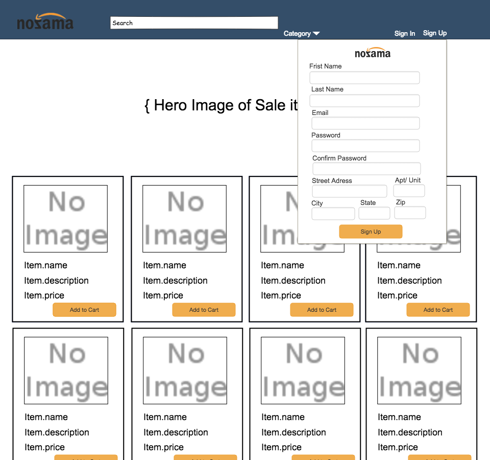

# Nozama Client

## Overview
Group project to create a website for Nozama, an e-commerce company that sells OGEL mini figures.

## Related Links
- [Deployed Site](https://ga-team-project.github.io/nozama_client/ "Nozama Deployed Site")
- [Nozama Back End](https://github.com/GA-Team-Project/nozama_client "Nozama Back End")
- [Nozama Front End](https://github.com/GA-Team-Project/nozama-api "Nozama Back End")
- [Deployed Back End](https://afternoon-coast-29423.herokuapp.com/ "Nozama Deployed Back End")

## Technologies
- HTML
- CSS/Bootstrap
- Handlebars
- JavaScript
- JQuery
## Planning Tools
- Trello

## Group Culture
### R.E.A.L  

Relax atmosphere and made the process fun   
Everyone is involve and participate  
Attentive to all details and got the job done  
Love to explore creative solutions when problem solving 

## Planning Process
 ### Scrum Plan
 We started with a with a ... 
 
 Sprint which included the overview of the project, assigned roles, a daily plan and a detailed schedule for the requirements. 

 Each day we had a "sit down" to go over new tasks and blocks. Along with a mid day check-in and recap at the end of the day.

 ### Daily plan 
9:10am  - "Sit Down"  
9:25am  -   Start on assigned tasks  
10:30am - Reminder to commit  
11:45am - mid day "Sit Down"  
Noon    - Lunch  
1pm  -  Group Troubleshoot  
2pm - Return to working on assigned tasks
4:30 pm - End of day recap and adjustment. Review next day plan. 

## Front End Plan
Input the HTML and CSS (wireframe look)  
Add handle bars to display items  
Add the event handlers to the all  

## User Stories
Anyone can see the items on the site 
Anyone can sign-up, sign-in  change-password and sign-out  

    Signed in users can...
Users can see items  
Users can see and edit CRUD settings  
User can place orders  
User can view past orders  

## Wireframe

## Success
- Leveraging Bootstrap
- Inputing JQuery selectors
- Inputing HTML/ CSS

## Blocks
- User fist name not appearing where we drafted. A few fails but kept pushing through
- Using logis to display persistant shopping cart

